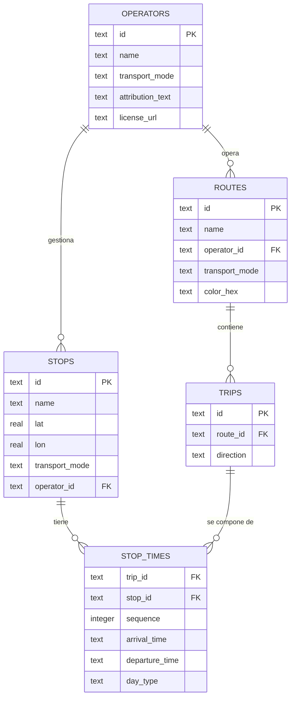

# Esquema de Base de Datos - CadizTransit

Este documento describe el esquema de la base de datos SQLite embebida en la aplicación. La fuente de verdad del DDL se encuentra en `tools/data_pipeline/schema.sql`.

## Diagrama de Entidad-Relación

## Detalle de Tablas

### `operators`
Almacena los operadores de transporte (ej. Consorcio de Transportes, Renfe).
- `transport_mode`: Uno de `bus`, `tram`, `commuter_rail`, `catamaran`.

### `stops`
Paradas físicas geolocalizadas.
- `lat` / `lon`: Coordenadas dentro de la provincia de Cádiz (Lat: [36.0, 37.0], Lon: [-6.4, -5.2]).

### `routes`
Líneas de transporte (ej. M-010, Línea 1 Cercanías).

### `trips`
Trayectos específicos de una ruta.
- `direction`: `outbound` (ida) o `inbound` (vuelta).

### `stop_times`
Horarios de paso de cada viaje por cada parada.
- `day_type`: `weekday` (L-V), `saturday` (S), `holiday` (D y festivos).
- `arrival_time` / `departure_time`: Formato `HH:MM:SS`.

## Índices
Se han creado índices en las claves foráneas y en combinaciones frecuentes de búsqueda como `(stop_id, day_type)` para agilizar la obtención de horarios desde una parada.
